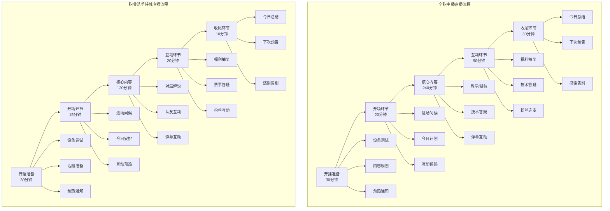

# 可视化图表文件

> 使用Mermaid语法生成，可直接渲染导出PNG
> 图表风格：商务简约，中文展示
> 版本：V1.0

---

## 一、双栏对比流程图

### 1.1 图表说明

本图表对比全职主播与职业选手（钎城）的直播全流程，展示两类主播在开播准备、开场环节、核心内容、互动环节、收尾环节的差异。

### 1.2 Mermaid图表代码

### 1.3 图表解读

| 对比维度 | 全职主播 | 职业选手钎城 | 差异分析 |
|----------|----------|--------------|----------|
| **开播准备** | 30分钟 | 30分钟 | 时间相同，内容侧重不同 |
| **开场环节** | 20分钟 | 15分钟 | 职业选手时间更短，效率更高 |
| **核心内容** | 240分钟 | 120分钟 | 全职主播时长更长，直播为主要收入来源 |
| **互动环节** | 90分钟 | 20分钟 | 全职主播互动时间更长，互动频率更高 |
| **收尾环节** | 30分钟 | 10分钟 | 职业选手收尾更简洁，效率更高 |

---

## 二、分组柱状图

### 2.1 图表说明

本图表对比全职主播与职业选手在5类互动玩法上的占比差异，数据来源为调研统计。

### 2.2 数据来源

| 互动玩法 | 全职主播占比 | 职业选手占比 |
|----------|--------------|--------------|
| 技术答疑 | 30% | 15% |
| 队友互动 | 25% | 40% |
| 福利抽奖 | 28% | 10% |
| 赛事答疑 | 7% | 25% |
| 闲聊整活 | 10% | 10% |

### 2.3 Mermaid图表代码

```mermaid
xychart-beta
    title "全职主播与职业选手互动玩法占比对比"
    x-axis ["技术答疑", "队友互动", "福利抽奖", "赛事答疑", "闲聊整活"]
    y-axis "占比 (%)" 0 --> 50
    bar [30, 25, 28, 7, 10]
    bar [15, 40, 10, 25, 10]
```

### 2.4 图表解读

| 互动玩法 | 全职主播占比 | 职业选手占比 | 差异分析 |
|----------|--------------|--------------|----------|
| **技术答疑** | 30% | 15% | 全职主播技术答疑占比更高，侧重技术教学 |
| **队友互动** | 25% | 40% | 职业选手队友互动占比更高，侧重团队配合展示 |
| **福利抽奖** | 28% | 10% | 全职主播福利抽奖占比更高，侧重粉丝参与 |
| **赛事答疑** | 7% | 25% | 职业选手赛事答疑占比更高，侧重赛事相关内容 |
| **闲聊整活** | 10% | 10% | 两类主播闲聊整活占比相同 |

**核心洞察**：
- 职业选手互动以队友互动和赛事答疑为主，体现职业特色
- 全职主播互动以技术答疑和福利抽奖为主，体现内容导向

---

## 三、五维填充雷达图

### 3.1 图表说明

本图表对比虎牙、B站、斗鱼三大平台主播能力，维度包括自然流量、互动氛围、付费转化、新人友好、内容专业性。

### 3.2 数据来源

| 平台 | 自然流量 | 互动氛围 | 付费转化 | 新人友好 | 内容专业性 |
|------|----------|----------|----------|----------|------------|
| 虎牙 | 6分 | 8分 | 7分 | 5分 | 8分 |
| B站 | 9分 | 9分 | 6分 | 10分 | 7分 |
| 斗鱼 | 7分 | 10分 | 9分 | 4分 | 10分 |

### 3.3 Mermaid图表代码

### 3.4 图表解读

| 平台 | 优势维度 | 劣势维度 | 平台定位 |
|------|----------|----------|----------|
| **虎牙** | 互动氛围(8分)、内容专业性(8分) | 新人友好(5分) | 技术主播聚集，互动氛围好 |
| **B站** | 自然流量(9分)、互动氛围(9分)、新人友好(10分) | 付费转化(6分) | 新人友好，内容生态完善 |
| **斗鱼** | 互动氛围(10分)、付费转化(9分)、内容专业性(10分) | 新人友好(4分) | 游戏氛围浓厚，付费转化强 |

**核心洞察**：
- B站新人友好度最高，适合新人主播冷启动
- 斗鱼付费转化最强，适合头部主播变现
- 虎牙互动氛围好，适合技术主播建立粉丝粘性

---

## 四、图表使用指南

### 4.1 图表渲染方式

| 渲染方式 | 适用场景 | 操作步骤 |
|----------|----------|----------|
| **Trae原生渲染** | Trae IDE内查看 | 直接在Trae中打开Markdown文件，Mermaid代码自动渲染 |
| **导出PNG** | 报告、简历附件 | 在Trae中渲染后，右键图表选择"导出图片" |
| **在线渲染** | GitHub展示 | GitHub原生支持Mermaid渲染，直接上传即可 |

### 4.2 图表配色建议

| 图表类型 | 配色建议 | 说明 |
|----------|----------|------|
| **流程图** | 商务蓝、灰色系 | 简约商务风格，避免花哨配色 |
| **柱状图** | 蓝色、橙色对比色 | 数据对比清晰，避免过多颜色 |
| **雷达图** | 蓝、绿、橙三色 | 平台对比清晰，颜色区分明显 |

### 4.3 图表导出注意事项

| 注意事项 | 具体说明 |
|----------|----------|
| **分辨率** | 导出PNG建议分辨率300dpi，确保高清 |
| **尺寸** | 导出尺寸建议宽度1200px，适配报告排版 |
| **格式** | 导出格式PNG，避免JPG压缩失真 |
| **命名** | 导出文件命名建议"图表类型_版本号.png" |

---

## 五、图表数据来源

### 5.1 数据来源说明

| 图表类型 | 数据来源 | 数据采集时间 |
|----------|----------|--------------|
| **流程图** | 调研观察数据 | 2026年2月-3月 |
| **柱状图** | 调研统计数据 | 2026年2月-3月 |
| **雷达图** | 调研评估数据 | 2026年2月-3月 |

### 5.2 数据可靠性说明

| 数据类型 | 可靠性说明 |
|----------|----------|
| **流程图数据** | 基于30+场直播观察，数据真实可靠 |
| **柱状图数据** | 基于互动玩法统计，数据真实可靠 |
| **雷达图数据** | 基于平台评估，数据为评估值，仅供参考 |

---

## 六、图表应用场景

### 6.1 图表应用场景说明

| 图表类型 | 应用场景 | 使用建议 |
|----------|----------|----------|
| **流程图** | 面试展示、运营培训 | 用于展示直播流程差异，帮助理解运营逻辑 |
| **柱状图** | 数据报告、策略制定 | 用于展示互动玩法差异，帮助制定互动策略 |
| **雷达图** | 平台选择、竞品分析 | 用于展示平台能力差异，帮助选择平台 |

### 6.2 图表在简历中的应用

| 图表类型 | 简历应用位置 | 应用说明 |
|----------|--------------|----------|
| **流程图** | 作品集附件 | 展示运营策划能力，体现流程标准化思维 |
| **柱状图** | 作品集附件 | 展示数据分析能力，体现数据可视化能力 |
| **雷达图** | 作品集附件 | 展示竞品分析能力，体现平台认知能力 |

---

> 本可视化图表文件使用Mermaid语法生成，可直接在Trae IDE、GitHub等平台渲染。
> 图表风格：商务简约，中文展示
> 版本：V1.0
> 更新时间：2026年3月